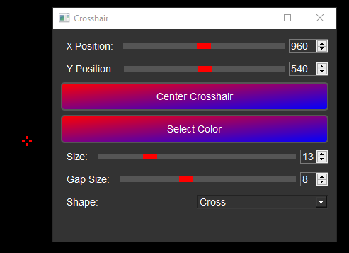

# SimpleCrosshair

**SimpleCrosshair** is a lightweight and customizable crosshair overlay application built using Python and PyQt5. It allows users to create a persistent crosshair overlay that can be customized in size, shape, color, and position. Ideal for gamers, developers, and users who need a crosshair overlay for any task.

## Features

- **Custom Shapes**: Choose between a crosshair or circle shape.
- **Adjustable Size and Gap**: Control the size of the crosshair and the gap between its elements.
- **Color Selection**: Pick any color for your crosshair using a color picker.
- **Positioning**: Adjust the crosshair's position or center it on the screen.
- **Always on Top**: The crosshair stays on top of other windows for uninterrupted use.
- **Save/Load Settings**: Your preferences are saved automatically and loaded when the application starts.

## Screenshots

  
*Example of a customized crosshair overlay.*

## Installation

No installation needed, just download and run.

## Building the executable yourself

### Prerequisites

Ensure you have Python 3.x installed on your system. You will also need the following Python packages:
- [PyQt5](https://pypi.org/project/PyQt5/)
- [pywin32](https://pypi.org/project/pywin32/) (for Windows-specific functionality)

You can install the required packages using pip:

```bash
pip install PyQt5 pywin32

### You can create a standalone executable using PyInstaller. Follow these steps:

First, ensure that PyInstaller is installed:

```bash
pip install pyinstaller

Then, in the root directory of the project, run:

```bash
pyinstaller --onefile --noconsole --add-data "icon.png;." crosshairapp.py

This command creates a single .exe file with no console